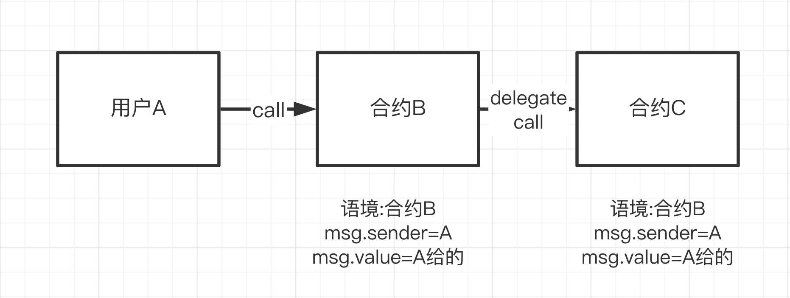

# WTF Cairo极简教程: 27. 库调度器

我最近在学`cairo-lang`，巩固一下细节，也写一个`WTF Cairo极简教程`，供小白们使用。教程基于`cairo 2.2.0`版本。

推特：[@0xAA_Science](https://twitter.com/0xAA_Science)｜[@WTFAcademy_](https://twitter.com/WTFAcademy_)

WTF Academy 社群：[Discord](https://discord.gg/5akcruXrsk)｜[微信群](https://docs.google.com/forms/d/e/1FAIpQLSe4KGT8Sh6sJ7hedQRuIYirOoZK_85miz3dw7vA1-YjodgJ-A/viewform?usp=sf_link)｜[官网 wtf.academy](https://wtf.academy)

所有代码和教程开源在 github: [github.com/WTFAcademy/WTF-Cairo](https://github.com/WTFAcademy/WTF-Cairo)

---

在这一讲中，我们将介绍Cairo中的库调度器（Library Dispatcher），它由接口合约自动生成，帮助你调用库合约，使用起来像Solidity中的`delegatecall`。

## 库调度器

与合约调度器类似，库调度器也是由接口合约自动生成，帮助你调用库合约。但是，使用合约调度器调用目标合约时，上下文是目标合约；而使用库调度器调用目标合约时，上下文是本合约。这也是为什么它用起来像Solidity中的`delegatecall`。



另外与以太坊不同，Starknet将合约的代码（`code`）和存储（`storage`）分开存放。当你`declare`合约时，会将合约的代码存储到链上，并可以通过`class_hash`查询；之后`deploy`合约时，才会初始化合约并分配存储。由于`delegatecall`仅使用目标合约的代码，而不需要用到状态变量，因此只需要`class_hash`即可调用。也就是说，每个`declare`在Starknet上的合约都可以作为库合约使用。

以我们上一讲中的`IMiniERC20`接口合约为例：

```rust
#[starknet::interface]
trait IMiniERC20<TContractState> {
    fn name(self: @TContractState) -> felt252;
    fn symbol(self: @TContractState) -> felt252;
}
```

编译器自动生成的库调度器如下：

```rust
#[derive(Copy, Drop, starknet::Store, Serde)]
struct IMiniERC20LibraryDispatcher {
    class_hash: starknet::ClassHash,
}

trait IMiniERC20DispatcherTrait<T> {
    fn name(self: T) -> felt252;
    fn symbol(self: T) -> felt252;
}

impl IMiniERC20LibraryDispatcherImpl of IMiniERC20DispatcherTrait<IMiniERC20LibraryDispatcher> {
    fn name(
        self: IMiniERC20Dispatcher
    ) -> felt252 { 
        // 使用starknet::library_call_syscall调用相应函数
    }
    fn symbol(
        self: IMiniERC20Dispatcher
    ) {         
        // 使用starknet::library_call_syscall调用相应函数
    }
}
```

下面我们写一个合约，利用库调度器调用`mini_erc_20`库。

```rust
#[starknet::contract]
mod librarycall_mini_erc_20 {
    use starknet::ContractAddress;
    use super::IMiniERC20DispatcherTrait;
    use super::IMiniERC20LibraryDispatcher;

    #[storage]
    struct Storage {
        name: felt252,
        symbol: felt252,
    }


    #[constructor]
    fn constructor(
        ref self: ContractState,
        name_: felt252,
        symbol_: felt252,
    ) {
        self.name.write(name_);
        self.symbol.write(symbol_);
    }

    #[external(v0)]
    fn get_name(self: @ContractState, class_hash: starknet::ClassHash) -> felt252 {
        IMiniERC20LibraryDispatcher { class_hash }.name()
    }

    #[external(v0)]
    fn get_symbol(self: @ContractState, class_hash: starknet::ClassHash) -> felt252 {
        IMiniERC20LibraryDispatcher { class_hash }.symbol()
    }
}
```

要注意的几点：

- 合约中，你需要在合约中引入`DispatcherTrait`和`LibraryDispatcher`。
- 合约中，要保证状态变量和库合约的状态变量布局一致，类似Solidity的代理合约。
- 调用时，你需要使用`IMiniERC20LibraryDispatcher`并传入目标库的`class_hash`。

## 总结

这一讲，我们介绍了Cairo中的库调度器，由接口合约自动生成，方便你调用其他合约。但是与合约调度器不同，它在调用时使用的是当前合约的上下文，类似于Solidity中的`delegatecall`，使用时需要注意。